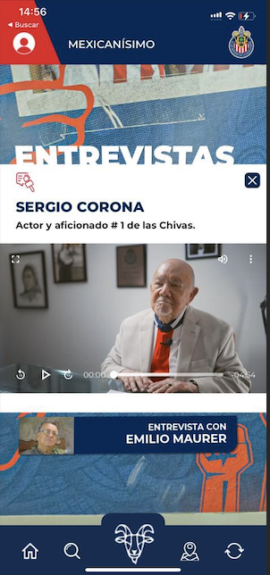
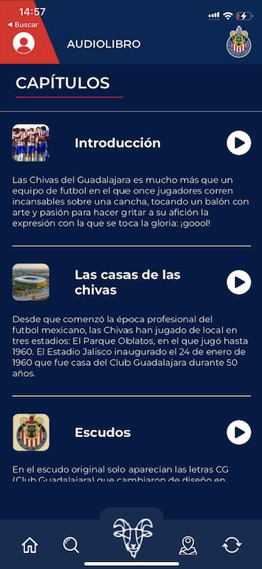

# LibroDigitalOficialChivas

El repo, es privado, esto es una pequeña muestra de esta gran app, con fines de demostrar mi experiencia laboral.
La app contiene bastantes cosas, sin embargo, se mostrata algunas de las features mas importantes.

## Features
- **Tour Interactivo 3D del estadio Akron**
El usuario interactua con el tour virtual y desde la app en flutter se reciben ciertos eventos para desplegar información. Se utiliza el plugin flutter_inappwebview para la comunicación con JS.

- **AI-voice chat**
Los usuarios pueden realizar preguntas con voz y recibir respuesta en voz de la IA, se utiliza openAI API. Para el speech-to-text se utiliza el pugin speech_to_text y para el Text-to-speech se utiliza el plugin flutter_tts.

- **Video-player**

- **Audio-player**

- **AR models**

### Other Features

- **Log-in con Firebase Auth**
Se incluye recuperación de contraseña y verificacion de cuenta con email

- **Firebase Storage**
Se guardan imagenes y contenidos multimedia usando Firebase Storage y en la app se guardan en cache una vez se hace el request.

- **State Management BLoC**
Se utiliza Bloc para varias funcionalidades de la app

