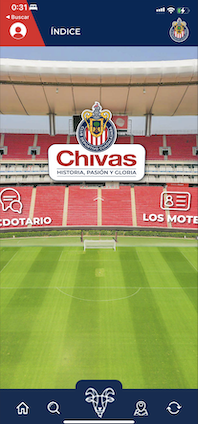
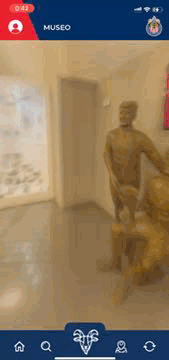
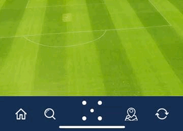

# LibroDigitalOficialChivas

El repo, es privado, esto es una pequeña muestra de esta gran app, con fines de demostrar mi experiencia laboral.

## Features
- **Tour Interactivo 3D del estadio Akron**
El usuario interactua con el tour virtual y desde la app en flutter se reciben ciertos eventos para desplegar información. Se utiliza el plugin flutter_inappwebview para la comunicación con JS.

- **AI-voice chat**
Los usuarios pueden realizar preguntas con voz y recibir respuesta en voz de la IA, se utiliza openAI API. Para el speech-to-text se utiliza el pugin speech_to_text y para el Text-to-speech se utiliza el plugin flutter_tts.

